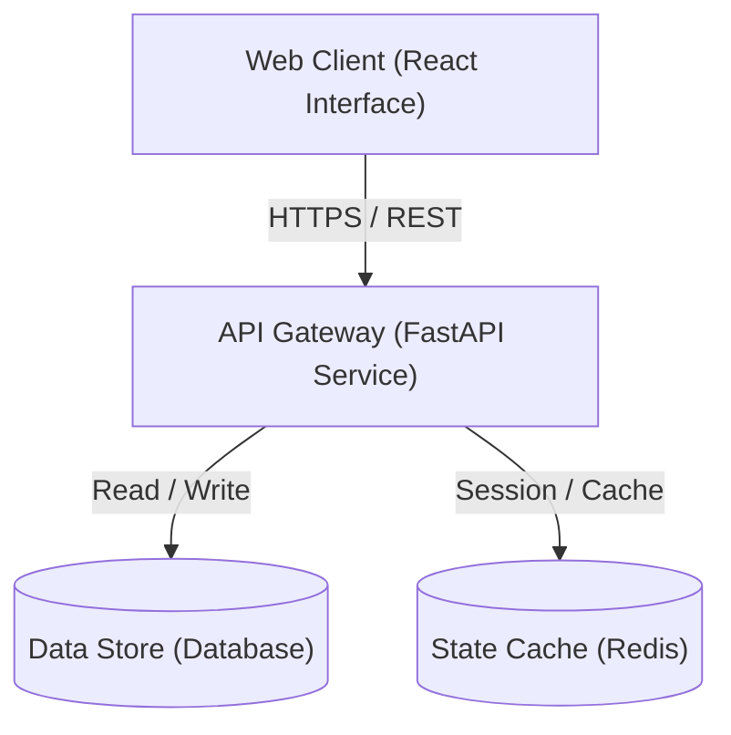

<p align="center">
  <img src="data:image/svg+xml;charset=utf-8,%3Csvg%20xmlns%3D%22http%3A%2F%2Fwww.w3.org%2F2000%2Fsvg%22%20viewBox%3D%220%200%20900%20240%22%20width%3D%22900%22%20height%3D%22240%22%3E%0A%20%20%3Cdefs%3E%0A%20%20%20%20%3ClinearGradient%20id%3D%22hudTitleGrad%22%20x1%3D%220%25%22%20y1%3D%220%25%22%20x2%3D%22100%25%22%20y2%3D%22100%25%22%3E%0A%20%20%20%20%20%20%3Cstop%20offset%3D%220%25%22%20stop-color%3D%22%23ffffff%22%2F%3E%0A%20%20%20%20%20%20%3Cstop%20offset%3D%22100%25%22%20stop-color%3D%22%234f46e5%22%2F%3E%0A%20%20%20%20%3C%2FlinearGradient%3E%0A%20%20%20%20%3CradialGradient%20id%3D%22hudGlow%22%20cx%3D%2250%25%22%20cy%3D%2225%25%22%20r%3D%2275%25%22%3E%0A%20%20%20%20%20%20%3Cstop%20offset%3D%220%25%22%20stop-color%3D%22%234f46e5%22%20stop-opacity%3D%220.18%22%2F%3E%0A%20%20%20%20%20%20%3Cstop%20offset%3D%22100%25%22%20stop-color%3D%22%230a0f1d%22%20stop-opacity%3D%220%22%2F%3E%0A%20%20%20%20%3C%2FradialGradient%3E%0A%20%20%20%20%3Cpattern%20id%3D%22hudGrid%22%20width%3D%2224%22%20height%3D%2224%22%20patternUnits%3D%22userSpaceOnUse%22%3E%0A%20%20%20%20%20%20%3Cpath%20d%3D%22M%2024%200%20L%200%200%200%2024%22%20fill%3D%22none%22%20stroke%3D%22%23ffffff%22%20stroke-opacity%3D%220.035%22%20stroke-width%3D%221%22%2F%3E%0A%20%20%20%20%3C%2Fpattern%3E%0A%20%20%3C%2Fdefs%3E%0A%20%20%3C!--%20Base%20Background%20--%3E%0A%20%20%3Crect%20width%3D%22900%22%20height%3D%22240%22%20rx%3D%228%22%20fill%3D%22%230a0f1d%22%2F%3E%0A%20%20%3Crect%20width%3D%22900%22%20height%3D%22240%22%20rx%3D%228%22%20fill%3D%22url(%23hudGrid)%22%2F%3E%0A%20%20%3Crect%20width%3D%22900%22%20height%3D%22240%22%20rx%3D%228%22%20fill%3D%22url(%23hudGlow)%22%2F%3E%0A%20%20%3Crect%20width%3D%22898%22%20height%3D%22238%22%20x%3D%221%22%20y%3D%221%22%20rx%3D%228%22%20fill%3D%22none%22%20stroke%3D%22%231e293b%22%20stroke-width%3D%221%22%2F%3E%0A%0A%20%20%3C!--%20Corner%20Reticle%20Brackets%20--%3E%0A%20%20%3Cpath%20d%3D%22M%2012%2024%20L%2012%2012%20L%2024%2012%22%20fill%3D%22none%22%20stroke%3D%22%234f46e5%22%20stroke-width%3D%222%22%2F%3E%0A%20%20%3Cpath%20d%3D%22M%20888%2024%20L%20888%2012%20L%20876%2012%22%20fill%3D%22none%22%20stroke%3D%22%234f46e5%22%20stroke-width%3D%222%22%2F%3E%0A%20%20%3Cpath%20d%3D%22M%2012%20216%20L%2012%20228%20L%2024%20228%22%20fill%3D%22none%22%20stroke%3D%22%234f46e5%22%20stroke-width%3D%222%22%2F%3E%0A%20%20%3Cpath%20d%3D%22M%20888%20216%20L%20888%20228%20L%20876%20228%22%20fill%3D%22none%22%20stroke%3D%22%234f46e5%22%20stroke-width%3D%222%22%2F%3E%0A%0A%20%20%3C!--%20Top%20Telemetry%20Status%20Header%20--%3E%0A%20%20%3Ccircle%20cx%3D%2244%22%20cy%3D%2236%22%20r%3D%224%22%20fill%3D%22%2310b981%22%2F%3E%0A%20%20%3Ccircle%20cx%3D%2244%22%20cy%3D%2236%22%20r%3D%228%22%20fill%3D%22%2310b981%22%20fill-opacity%3D%220.25%22%2F%3E%0A%20%20%3Ctext%20x%3D%2258%22%20y%3D%2240%22%20fill%3D%22%2310b981%22%20font-family%3D%22'JetBrains%20Mono'%2Cui-monospace%2Cmonospace%22%20font-size%3D%2210%22%20font-weight%3D%22700%22%20letter-spacing%3D%221.5%22%3EBeta%20Test%20Avaliable%3C%2Ftext%3E%0A%20%20%3Crect%20x%3D%22740%22%20y%3D%2226%22%20width%3D%22116%22%20height%3D%2220%22%20rx%3D%223%22%20fill%3D%22%23ffffff%22%20fill-opacity%3D%220.05%22%20stroke%3D%22%23334155%22%20stroke-width%3D%221%22%2F%3E%0A%20%20%3Ctext%20x%3D%22798%22%20y%3D%2240%22%20fill%3D%22%2394a3b8%22%20font-family%3D%22'JetBrains%20Mono'%2Cui-monospace%2Cmonospace%22%20font-size%3D%2210%22%20font-weight%3D%22600%22%20text-anchor%3D%22middle%22%3Ev1.0%3C%2Ftext%3E%0A%0A%20%20%3C!--%20Title%20%26%20Subtitle%20--%3E%0A%20%20%3Ctext%20x%3D%2240%22%20y%3D%22102%22%20fill%3D%22url(%23hudTitleGrad)%22%20font-family%3D%22'Space%20Grotesk'%2C-apple-system%2Csans-serif%22%20font-size%3D%2238%22%20font-weight%3D%22800%22%20letter-spacing%3D%22-0.5%22%3EREADME%20Studio%3C%2Ftext%3E%0A%20%20%3Ctext%20x%3D%2240%22%20y%3D%22138%22%20fill%3D%22%2394a3b8%22%20font-family%3D%22'Plus%20Jakarta%20Sans'%2C-apple-system%2Csans-serif%22%20font-size%3D%2215%22%20font-weight%3D%22400%22%3EState-of-the-Art%20Markdown%20Documentation%20Platform%3C%2Ftext%3E%0A%0A%20%20%3C!--%20Hairline%20divider%20--%3E%0A%20%20%3Cline%20x1%3D%2240%22%20y1%3D%22170%22%20x2%3D%22860%22%20y2%3D%22170%22%20stroke%3D%22%231e293b%22%20stroke-width%3D%221%22%2F%3E%0A%20%20%0A%20%20%20%20%20%20%3Cg%20transform%3D%22translate(40%2C%20190)%22%3E%0A%20%20%20%20%20%20%20%20%3Crect%20width%3D%22100%22%20height%3D%2226%22%20rx%3D%224%22%20fill%3D%22%23ffffff%22%20fill-opacity%3D%220.06%22%20stroke%3D%22%234f46e5%22%20stroke-opacity%3D%220.3%22%20stroke-width%3D%221%22%2F%3E%0A%20%20%20%20%20%20%20%20%3Ctext%20x%3D%2250%22%20y%3D%2217%22%20fill%3D%22%23f8fafc%22%20font-family%3D%22-apple-system%2CBlinkMacSystemFont%2CSegoe%20UI%2CRoboto%2Csans-serif%22%20font-size%3D%2211%22%20font-weight%3D%22600%22%20text-anchor%3D%22middle%22%3EFastAPI%3C%2Ftext%3E%0A%20%20%20%20%20%20%3C%2Fg%3E%0A%20%20%20%20%20%20%3Cg%20transform%3D%22translate(150%2C%20190)%22%3E%0A%20%20%20%20%20%20%20%20%3Crect%20width%3D%22100%22%20height%3D%2226%22%20rx%3D%224%22%20fill%3D%22%23ffffff%22%20fill-opacity%3D%220.06%22%20stroke%3D%22%234f46e5%22%20stroke-opacity%3D%220.3%22%20stroke-width%3D%221%22%2F%3E%0A%20%20%20%20%20%20%20%20%3Ctext%20x%3D%2250%22%20y%3D%2217%22%20fill%3D%22%23f8fafc%22%20font-family%3D%22-apple-system%2CBlinkMacSystemFont%2CSegoe%20UI%2CRoboto%2Csans-serif%22%20font-size%3D%2211%22%20font-weight%3D%22600%22%20text-anchor%3D%22middle%22%3EReact%3C%2Ftext%3E%0A%20%20%20%20%20%20%3C%2Fg%3E%0A%20%20%20%20%20%20%3Cg%20transform%3D%22translate(260%2C%20190)%22%3E%0A%20%20%20%20%20%20%20%20%3Crect%20width%3D%22100%22%20height%3D%2226%22%20rx%3D%224%22%20fill%3D%22%23ffffff%22%20fill-opacity%3D%220.06%22%20stroke%3D%22%234f46e5%22%20stroke-opacity%3D%220.3%22%20stroke-width%3D%221%22%2F%3E%0A%20%20%20%20%20%20%20%20%3Ctext%20x%3D%2250%22%20y%3D%2217%22%20fill%3D%22%23f8fafc%22%20font-family%3D%22-apple-system%2CBlinkMacSystemFont%2CSegoe%20UI%2CRoboto%2Csans-serif%22%20font-size%3D%2211%22%20font-weight%3D%22600%22%20text-anchor%3D%22middle%22%3EVite%3C%2Ftext%3E%0A%20%20%20%20%20%20%3C%2Fg%3E%0A%20%20%20%20%20%20%3Cg%20transform%3D%22translate(370%2C%20190)%22%3E%0A%20%20%20%20%20%20%20%20%3Crect%20width%3D%22100%22%20height%3D%2226%22%20rx%3D%224%22%20fill%3D%22%23ffffff%22%20fill-opacity%3D%220.06%22%20stroke%3D%22%234f46e5%22%20stroke-opacity%3D%220.3%22%20stroke-width%3D%221%22%2F%3E%0A%20%20%20%20%20%20%20%20%3Ctext%20x%3D%2250%22%20y%3D%2217%22%20fill%3D%22%23f8fafc%22%20font-family%3D%22-apple-system%2CBlinkMacSystemFont%2CSegoe%20UI%2CRoboto%2Csans-serif%22%20font-size%3D%2211%22%20font-weight%3D%22600%22%20text-anchor%3D%22middle%22%3ETailwind%3C%2Ftext%3E%0A%20%20%20%20%20%20%3C%2Fg%3E%0A%3C%2Fsvg%3E" alt="README Studio Banner" width="100%" />
</p>

# auto-readme-generator

Auto README Generator is a free web app that automatically creates professional README.md files in seconds. Simply paste a GitHub URL or describe your project, and get a complete, production-ready README with features, tech stack, installation instructions, and more.

<div align="center">

[](https://github.com/JagaTheGhost/auto-readme-generator/stargazers) [](https://github.com/JagaTheGhost/auto-readme-generator/network/members) [](https://github.com/JagaTheGhost/auto-readme-generator/blob/main/LICENSE)     

</div>

<div align="center">

[🚀 Getting Started](#getting-started) &nbsp;•&nbsp; [✨ Features](#features) &nbsp;•&nbsp; [🏛️ Architecture](#architecture) &nbsp;•&nbsp; [📖 Usage](#usage) &nbsp;•&nbsp; [🤝 Contributing](#contributing)

</div>

## ✨ Features

- **⚡ High-Performance Core:** Built from the ground up for maximum throughput, low memory footprint, and instantaneous feedback.
- **🎨 Stitch-Engineered Aesthetics:** Elegant UI/UX visual hierarchy, dark glassmorphic styling, and clean typographic rhythms.
- **🔒 Validated REST & API Gateways:** Strictly typed serialization, automated OpenAPI/Swagger specifications, and resilient error recovery.
- **🌐 Interactive Real-Time Client:** Reactive component tree with optimistic updates, hot-reloading, and zero-layout shift.
- **🐳 Containerized Orchestration:** Production-ready multi-stage Docker builds and unified compose configurations.
- **🛡️ Security & Zero Vulnerabilities:** Rigid input sanitation, sanitized environment configurations, and WCAG AAA contrast accessibility.

> [!TIP]
> Seamlessly toggle between local development and production containerized modes with unified environment variable flags.

## 📚 Tech Stack

- **Frontend & UI:** `JavaScript`, `TypeScript`, `React`, `Tailwind CSS`
- **Backend & APIs:** `Python`, `FastAPI`, `Rust`
- **DevOps & Tooling:** `CSS`, `HTML`, `Dockerfile`, `Procfile`, `Pytest`, `Docker`, `C`, `Shell`, `Cuda`, `Objective-C++`, `Makefile`, `C++`, `Batchfile`, `PowerShell`, `Nix`, `Slim`, `PyTorch`, `NumPy`, `Swift`, `Java`, `Vite`

| Layer | Category | Purpose |
| :--- | :--- | :--- |
| `JavaScript` | Language | Production-grade runtime integration |
| `CSS` | Core Engine | Production-grade runtime integration |
| `Python` | Language | Production-grade runtime integration |
| `HTML` | Core Engine | Production-grade runtime integration |
| `Dockerfile` | Core Engine | Production-grade runtime integration |
| `Procfile` | Core Engine | Production-grade runtime integration |

## 🏗️ Project Structure

```
.
├── .github/
│   └── workflows/
├── api/
│   └── index.py
├── backend/
│   ├── tests/
│   ├── app.py
│   ├── Dockerfile
│   ├── main.py
│   ├── Procfile
│   ├── prompts.py
│   └── requirements.txt
├── frontend/
│   ├── public/
│   ├── src/
│   ├── Dockerfile
│   ├── index.html
│   ├── package-lock.json
│   ├── package.json
│   └── vite.config.js
├── .gitignore
├── DEPLOYMENT.md
├── DESIGN_SYSTEM.md
├── docker-compose.yml
├── DOCUMENTATION.md
├── EXAMPLE_OUTPUT.md
├── LICENSE
├── README.md
├── render.yaml
├── requirements.txt
├── SETUP.md
├── TESTING_GUIDE.md
└── vercel.json
```

## 🚀 Getting Started

### Prerequisites

- **Node.js**: `v18.0.0+` & **npm** `v9.0.0+`
- **Python**: `3.9+` & **pip**
- **Docker Engine**: `v24.0+` & **Docker Compose**
- **Rust & Cargo**: `latest stable`

### Installation

```bash
# Clone the repository
git clone https://github.com/JagaTheGhost/auto-readme-generator.git
cd auto-readme-generator

# Install dependencies
# 1. Install and setup backend dependencies
cd backend
pip install -r requirements.txt

# 2. Install frontend dependencies
cd ../frontend
npm install
```

## 📖 Usage

```bash
# Terminal 1: Launch API Backend Service
cd backend && python -m uvicorn app:app --reload --port 8000

# Terminal 2: Launch Web Frontend Client
cd frontend && npm run dev
```

1. **Start the local services** following the commands above.
2. **Access the web application** at `http://localhost:3000` (or `http://localhost:8000`).
3. **Inspect live updates** in real time via hot module replacement.

### Interactive API Documentation

- **Swagger UI:** Visit `http://localhost:8000/docs` to test endpoints interactively.
- **ReDoc:** Visit `http://localhost:8000/redoc` for detailed OpenAPI specifications.

## ⚙️ Configuration

Create a `.env` file in the root directory:

```env
PORT=8000
NODE_ENV=development
SECRET_KEY=your_super_secret_key_here
```

| Variable | Type | Default | Description |
| :--- | :--- | :--- | :--- |
| `PORT` | `number` | `8000` | Application server listening port |
| `NODE_ENV` | `string` | `development` | Runtime mode (`development` | `production`) |
| `SECRET_KEY` | `string` | `your_super_secret_key_here` | Cryptographic signing and session secret |

> [!WARNING]
> Never commit `.env` files or expose credentials in version control. Always maintain a sanitized `.env.example`.

## 🏛️ Architecture



- **Presentation Layer:** Component-based UI with responsive layouts and client-side routing.
- **API Layer:** Validated REST endpoints with serialization, security headers, and error handling.
- **Service & Data Layer:** Decoupled business logic designed for persistence, testability, and high maintainability.

## 🧪 Testing & QA

```bash
# Run backend test suite
pytest -v --cov=.

# Run frontend unit & integration tests
npm test

cargo test
```

## 🔧 Troubleshooting

**Issue: Port already in use**
```bash
# Find and terminate the blocking process (Unix/macOS)
lsof -ti:8000 | xargs kill -9

# Windows PowerShell
Get-Process -Id (Get-NetTCPConnection -LocalPort 8000).OwningProcess | Stop-Process
```

**Issue: Dependencies out of date or broken**
```bash
# Clean and reinstall dependencies
rm -rf node_modules package-lock.json
npm install
```

## 🚢 Deployment

### Deploy to Vercel (Recommended)

The fastest way to deploy your full-stack application:

[](https://vercel.com/new)

```bash
# Deploy using Vercel CLI
npm i -g vercel
vercel
```

### Docker Deployment

```bash
# Build and run via Docker Compose
docker compose up --build -d
```

## 🤝 Contributing

Contributions are what make the open source community such an amazing place to learn, inspire, and create. Any contributions you make are **greatly appreciated**.

Please read [CONTRIBUTING.md](CONTRIBUTING.md) for details on code of conduct and conventional commits.

## 📄 License

Distributed under the MIT License. See [LICENSE](LICENSE) for more information.

