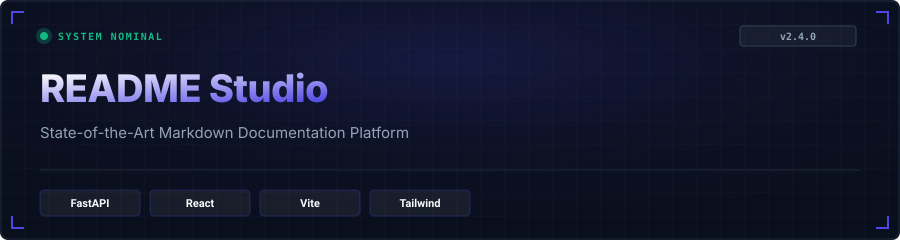
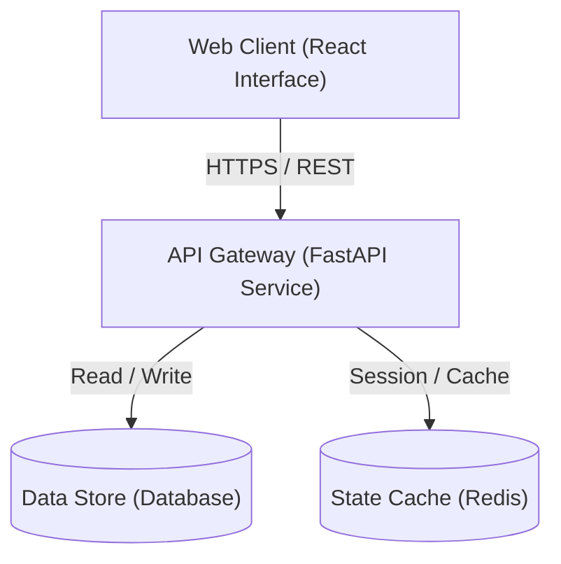

<p align="center">
  
</p>
# auto-readme-generator

Auto README Generator is a free web app that automatically creates professional README.md files in seconds. Simply paste a GitHub URL or describe your project, and get a complete, production-ready README with features, tech stack, installation instructions, and more.

<div align="center">

[](https://github.com/JagaTheGhost/auto-readme-generator/stargazers) [](https://github.com/JagaTheGhost/auto-readme-generator/network/members) [](https://github.com/JagaTheGhost/auto-readme-generator/blob/main/LICENSE)     

</div>

<div align="center">

[🚀 Getting Started](#getting-started) &nbsp;•&nbsp; [✨ Features](#features) &nbsp;•&nbsp; [🏛️ Architecture](#architecture) &nbsp;•&nbsp; [📖 Usage](#usage) &nbsp;•&nbsp; [🤝 Contributing](#contributing)

</div>

## ✨ Features

- **⚡ High-Performance Core:** Built from the ground up for maximum throughput, low memory footprint, and instantaneous feedback.
- **🎨 Stitch-Engineered Aesthetics:** Elegant UI/UX visual hierarchy, dark glassmorphic styling, and clean typographic rhythms.
- **🔒 Validated REST & API Gateways:** Strictly typed serialization, automated OpenAPI/Swagger specifications, and resilient error recovery.
- **🌐 Interactive Real-Time Client:** Reactive component tree with optimistic updates, hot-reloading, and zero-layout shift.
- **🐳 Containerized Orchestration:** Production-ready multi-stage Docker builds and unified compose configurations.
- **🛡️ Security & Zero Vulnerabilities:** Rigid input sanitation, sanitized environment configurations, and WCAG AAA contrast accessibility.

> [!TIP]
> Seamlessly toggle between local development and production containerized modes with unified environment variable flags.

## 📚 Tech Stack

- **Frontend & UI:** `JavaScript`, `TypeScript`, `React`, `Tailwind CSS`
- **Backend & APIs:** `Python`, `FastAPI`, `Rust`
- **DevOps & Tooling:** `CSS`, `HTML`, `Dockerfile`, `Procfile`, `Pytest`, `Docker`, `C`, `Shell`, `Cuda`, `Objective-C++`, `Makefile`, `C++`, `Batchfile`, `PowerShell`, `Nix`, `Slim`, `PyTorch`, `NumPy`, `Swift`, `Java`, `Vite`

| Layer | Category | Purpose |
| :--- | :--- | :--- |
| `JavaScript` | Language | Production-grade runtime integration |
| `CSS` | Core Engine | Production-grade runtime integration |
| `Python` | Language | Production-grade runtime integration |
| `HTML` | Core Engine | Production-grade runtime integration |
| `Dockerfile` | Core Engine | Production-grade runtime integration |
| `Procfile` | Core Engine | Production-grade runtime integration |

## 🏗️ Project Structure

```
.
├── .github/
│   └── workflows/
├── api/
│   └── index.py
├── backend/
│   ├── tests/
│   ├── app.py
│   ├── Dockerfile
│   ├── main.py
│   ├── Procfile
│   ├── prompts.py
│   └── requirements.txt
├── frontend/
│   ├── public/
│   ├── src/
│   ├── Dockerfile
│   ├── index.html
│   ├── package-lock.json
│   ├── package.json
│   └── vite.config.js
├── .gitignore
├── DEPLOYMENT.md
├── DESIGN_SYSTEM.md
├── docker-compose.yml
├── DOCUMENTATION.md
├── EXAMPLE_OUTPUT.md
├── LICENSE
├── README.md
├── render.yaml
├── requirements.txt
├── SETUP.md
├── TESTING_GUIDE.md
└── vercel.json
```

## 🚀 Getting Started

### Prerequisites

- **Node.js**: `v18.0.0+` & **npm** `v9.0.0+`
- **Python**: `3.9+` & **pip**
- **Docker Engine**: `v24.0+` & **Docker Compose**
- **Rust & Cargo**: `latest stable`

### Installation

```bash
# Clone the repository
git clone https://github.com/JagaTheGhost/auto-readme-generator.git
cd auto-readme-generator

# Install dependencies
# 1. Install and setup backend dependencies
cd backend
pip install -r requirements.txt

# 2. Install frontend dependencies
cd ../frontend
npm install
```

## 📖 Usage

```bash
# Terminal 1: Launch API Backend Service
cd backend && python -m uvicorn app:app --reload --port 8000

# Terminal 2: Launch Web Frontend Client
cd frontend && npm run dev
```

1. **Start the local services** following the commands above.
2. **Access the web application** at `http://localhost:3000` (or `http://localhost:8000`).
3. **Inspect live updates** in real time via hot module replacement.

### Interactive API Documentation

- **Swagger UI:** Visit `http://localhost:8000/docs` to test endpoints interactively.
- **ReDoc:** Visit `http://localhost:8000/redoc` for detailed OpenAPI specifications.

## ⚙️ Configuration

Create a `.env` file in the root directory:

```env
PORT=8000
NODE_ENV=development
SECRET_KEY=your_super_secret_key_here
```

| Variable | Type | Default | Description |
| :--- | :--- | :--- | :--- |
| `PORT` | `number` | `8000` | Application server listening port |
| `NODE_ENV` | `string` | `development` | Runtime mode (`development` | `production`) |
| `SECRET_KEY` | `string` | `your_super_secret_key_here` | Cryptographic signing and session secret |

> [!WARNING]
> Never commit `.env` files or expose credentials in version control. Always maintain a sanitized `.env.example`.

## 🏛️ Architecture



- **Presentation Layer:** Component-based UI with responsive layouts and client-side routing.
- **API Layer:** Validated REST endpoints with serialization, security headers, and error handling.
- **Service & Data Layer:** Decoupled business logic designed for persistence, testability, and high maintainability.

## 🧪 Testing & QA

```bash
# Run backend test suite
pytest -v --cov=.

# Run frontend unit & integration tests
npm test

cargo test
```

## 🔧 Troubleshooting

**Issue: Port already in use**
```bash
# Find and terminate the blocking process (Unix/macOS)
lsof -ti:8000 | xargs kill -9

# Windows PowerShell
Get-Process -Id (Get-NetTCPConnection -LocalPort 8000).OwningProcess | Stop-Process
```

**Issue: Dependencies out of date or broken**
```bash
# Clean and reinstall dependencies
rm -rf node_modules package-lock.json
npm install
```

## 🚢 Deployment

### Deploy to Vercel (Recommended)

The fastest way to deploy your full-stack application:

[](https://vercel.com/new)

```bash
# Deploy using Vercel CLI
npm i -g vercel
vercel
```

### Docker Deployment

```bash
# Build and run via Docker Compose
docker compose up --build -d
```

## 🤝 Contributing

Contributions are what make the open source community such an amazing place to learn, inspire, and create. Any contributions you make are **greatly appreciated**.

Please read [CONTRIBUTING.md](CONTRIBUTING.md) for details on code of conduct and conventional commits.

## 📄 License

Distributed under the MIT License. See [LICENSE](LICENSE) for more information.

